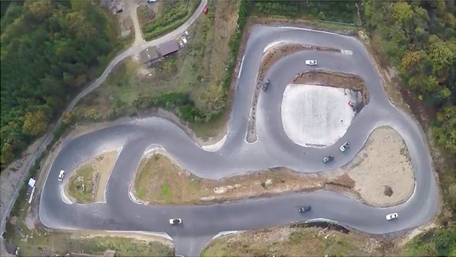

# Yamaguchi Style
## _Iwakuni Drifting Heroes_

Yamaguchi Style is a drift team based in Iwakuni, Japan. Founded in 2014, by Eric VanDamme, the primary objective of the team is to promote the sport of drifting to a wide audience and build meaningful relationships with similarly interested individuals.
